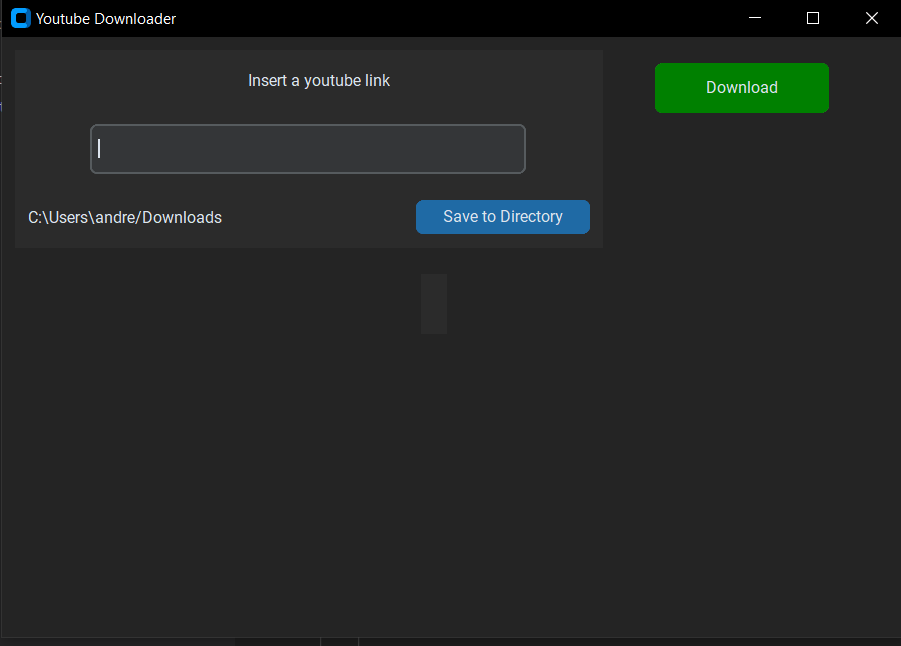

# youtube-video-downloader-python-GUI-

The YouTube Downloader is a Python application that allows you to download videos from YouTube. With this app, you can easily download your favorite videos and watch them offline without internet connectivity.



## Installation

To use the YouTube Downloader app, follow these steps:

1. Install Python on your system if it is not already installed.
2. Clone the repository to your local machine.
3. Install the necessary dependencies by running the following command in your terminal:

```
pip install -r requirements.txt
```

1. Run the app by navigating to the downloaded repository in your terminal and typing:

```
py main.py

```

## Usage

The YouTube Downloader app is easy to use. Simply copy the URL of the video you want to download and paste it into the app. Then, select the desired video quality and click on the download button. The app will download the video to your local machine(default to Downloads folder), and you can find it in the same directory as the app.

## Contributing

If you would like to contribute to the development of the YouTube Downloader app, please follow these steps:

1. Fork the repository on GitHub.
2. Make your changes and commit them with descriptive commit messages.
3. Create a pull request to merge your changes into the main branch.

## License

This app is licensed under the MIT license. See the LICENSE file for more details.

## Contact

For any questions or concerns, please email us at andrewlee_29@hotmail.com.

## To make the exe file:

Use pyinstaller and fill <>

```bash
pyinstaller --noconfirm --onedir --windowed --add-data "<CustomTkinter Location>/customtkinter;customtkinter/"  "<Path to Python Script>"
```
